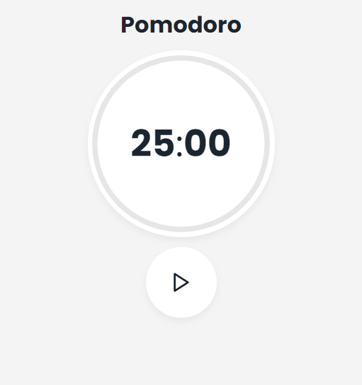
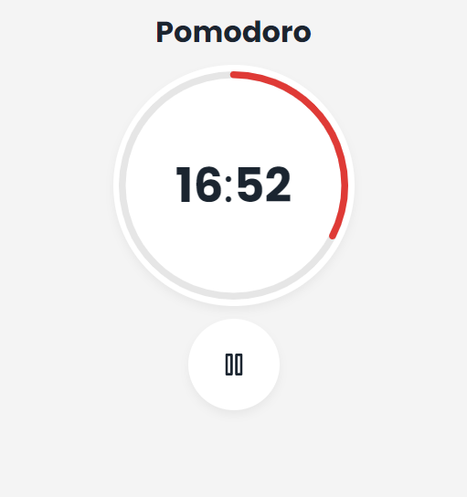

# Pomodoro

> A simple productivity web application.
## Screenshots
<div style="display: flex">
  
  
</div>

## Usage

The application can be accessed though [pomodoro.edurodrigues.dev](https://pomodoro.edurodrigues.dev), but you can also run it locally by cloning the repository.

First you need to install all the dependencies:
```bash
yarn
# or
npm install
```
Then simply run `start`:
```bash
yarn start
# or
npm run start
```
A browser window will automatically open on `localhost:3000`.

## License

This project is under [MIT](https://github.com/EduardoRodriguesF/pomodoro/blob/main/LICENSE) license.